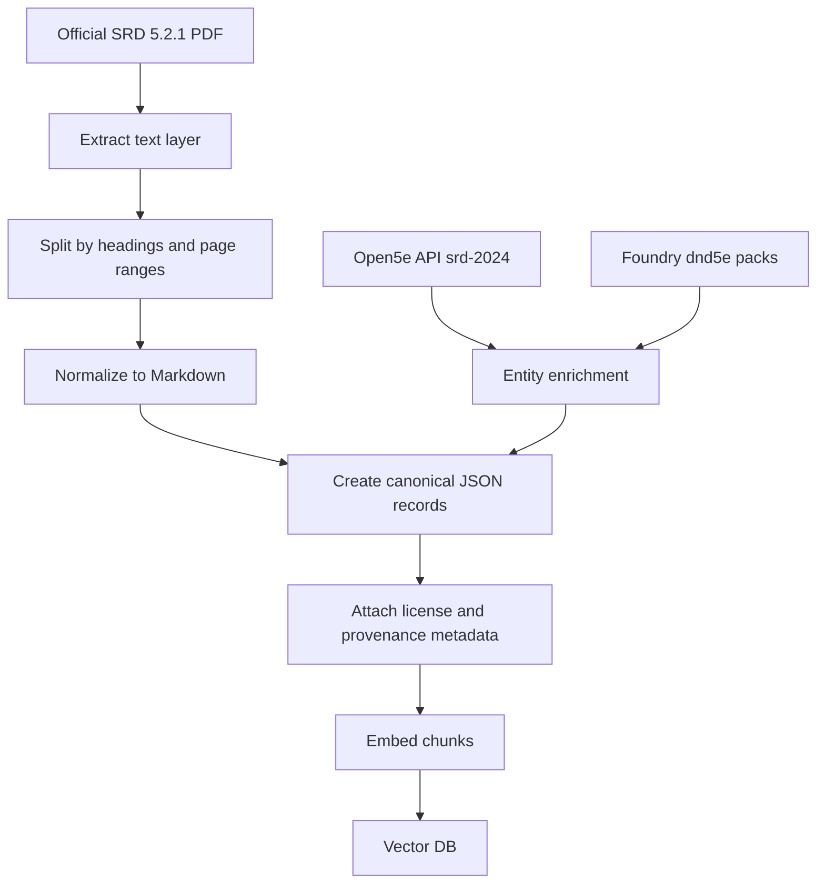
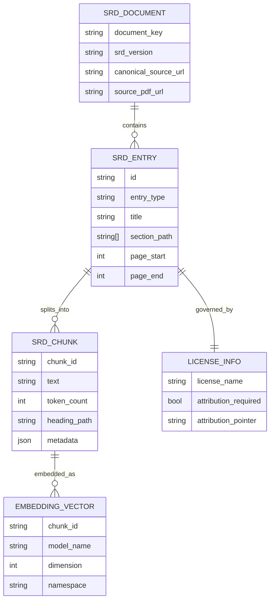

# Machine-Readable Acquisition Paths for the D&D SRD 5.2

## Executive summary

The safest foundation for a rules-answering agent built on Dungeons & Dragons SRD 5.2 is the official [D&D Beyond SRD hub](https://www.dndbeyond.com/srd/) plus the downloadable [SRD 5.2.1 PDF](https://media.dndbeyond.com/compendium-images/srd/5.2/SRD_CC_v5.2.1.pdf). In the official sources reviewed, the publisher exposes SRD 5.2 through that hub and PDF downloads; I did **not** find an official WotC JSON, YAML, or Markdown release. The current official file is version 5.2.1, and its legal page says the document is available under the Creative Commons Attribution 4.0 International License, can be used commercially with attribution, and may be labeled "compatible with fifth edition" or "5E compatible." [^1]

For practical machine-readable ingestion today, the strongest options are community-derived sources: [Foundry dnd5e](https://github.com/foundryvtt/dnd5e) for broad SRD 5.2 content in Foundry-style JSON documents, and [Open5e](https://open5e.com/) / [Open5e API](https://open5e.com/api-docs) for structured JSON that can be filtered to the `srd-2024` document. Smaller sources exist, such as [dmcb's SRD 5.2 spells gist](https://gist.github.com/dmcb/4b67869f962e3adaa3d0f7e5ca8f4912), but they are partial and, where no license is clearly surfaced, unsuitable as a commercial primary source. Several popular older projects - such as [BTMorton/dnd-5e-srd](https://github.com/BTMorton/dnd-5e-srd) and [5e-bits/5e-srd-api](https://github.com/5e-bits/5e-srd-api) / [5e-bits/5e-database](https://github.com/5e-bits/5e-database)-remain useful references, but their publicly documented production support is still centered on the 2014 SRD rather than SRD 5.2. [^2]

For a bootcamp capstone, the best balance of legal clarity and technical simplicity is: use the official PDF as the **canonical legal text**, extract and normalize it yourself, then optionally enrich or validate spell / monster / class objects against Open5e or Foundry. For storage, choose a managed service such as [Pinecone docs](https://docs.pinecone.io/) if you want the least ops, or an open-source stack such as [Milvus docs](https://milvus.io/) or [Weaviate docs](https://docs.weaviate.io/weaviate) if you want self-hostable infrastructure; for a purely local demo, [FAISS](https://github.com/facebookresearch/faiss) is usually the fastest path. [^3]

## Official sources and licensing

The authoritative publication point for SRD 5.2 is the official SRD page on [D&D Beyond](https://www.dndbeyond.com/srd/). The page currently presents SRD v5.2.1 and its FAQ states that SRD 5.2 is released under CC-BY-4.0, that future SRDs will use Creative Commons rather than OGL 1.0a, that SRD 5.2 can be used commercially, and that both SRD 5.1 and SRD 5.2 may be used in the same product as long as attribution is provided. It also states that once published under CC-BY-4.0, SRD 5.2 cannot be revoked, and that future versions such as 5.2.1 or 5.3 may appear while older versions remain available under their own licenses. [^4]

The current official PDF's legal-information page is the most important source to preserve in your project docs. It says SRD 5.2.1 is free of charge under CC-BY-4.0, requires a specific attribution statement, asks you not to add any other attribution to the publisher beyond that statement, and explicitly allows compatibility wording such as "compatible with fifth edition" or "5E compatible." For implementation purposes, you should treat page 1 of the official PDF as the canonical attribution text for any redistributed derivative dataset, prompt pack, or public-facing app docs. [^5]

The older Open Game License 1.0a remains relevant only when you intentionally use SRD 5.1 under OGL terms or when you depend on older community datasets whose licensing chain still points to OGL 1.0a. The official SRD page says SRD 5.1 is available under both CC-BY-4.0 and OGL 1.0a, while the official SRD 5.1 OGL PDF says OGL use requires including the license text and observing product-identity rules. If you are building specifically on SRD 5.2, OGL is **not** the default or recommended path anymore. [^6]

The publisher's official [Fan Content Policy](https://company.wizards.com/en/legal/fancontentpolicy) is **not** a substitute for the SRD 5.2 license in a commercial agent. The policy says fan content must be free, cannot require payment, subscription, or registration, cannot be sold or licensed to third parties, and does not include verbatim reposting of the publisher's rules text. It also says not to use the publisher's logos or trademarks and that the publisher's broader terms govern if there is a conflict. That means a commercial or monetized rules agent should rely on the SRD's CC-BY grant for SRD text, not on the fan-content-policy exception. [^7]

### Primary official sources to bookmark

| Source | What it governs | Why it matters |
|---|---|---|
| [D&D Beyond SRD hub](https://www.dndbeyond.com/srd/) | Official SRD publication point and FAQ | Canonical hub, current versioning, usage FAQ |
| [SRD 5.2.1 PDF](https://media.dndbeyond.com/compendium-images/srd/5.2/SRD_CC_v5.2.1.pdf) | Exact legal text and attribution language | Copy this attribution into your dataset/app docs |
| [SRD 5.1 OGL PDF](https://media.dndbeyond.com/compendium-images/srd/5.1/SRD-OGL_V5.1.pdf) | Legacy OGL path for 5.1 content | Only needed if you use OGL-based 5.1 material |
| [Fan Content Policy](https://company.wizards.com/en/legal/fancontentpolicy) | Non-SRD fan use of the publisher's IP | Useful mainly to understand what **not** to rely on for a commercial app |
| [CC BY 4.0 legal code](https://creativecommons.org/licenses/by/4.0/legalcode) | Base license terms | Share/adapt commercially with attribution |
| [Creator FAQ](https://www.dndbeyond.com/srd/) | Practical creator-facing explanation | Confirms that work built from SRD 5.2.1 / 5.1 is yours under CC-BY-4.0 |

## Dataset landscape

There is still a gap between the official publication and the formats most convenient for RAG. The official source is a PDF, not a structured API or schema-first dataset. The machine-readable landscape therefore breaks cleanly into four tiers: canonical-but-unstructured official PDF; high-value community structured sources with 5.2 coverage; HTML mirrors; and older 5.1-era projects that remain useful examples but are not current enough to serve as your primary 5.2 source. [^8]

### Comparison of major options

Rather than relying on the original wide comparison table, the options are summarized below in a layout that is easier to read in Word and PDF.

**Official D&D Beyond SRD / PDF**  
- **Maintainer / host:** Official publisher.  
- **SRD 5.2 completeness:** Full official text of current SRD 5.2.1.  
- **Format:** PDF with a usable text layer.  
- **License posture:** CC-BY-4.0 for SRD 5.2.1.  
- **Freshness:** Current official page is v5.2.1.  
- **Ease of parsing:** Medium.  
- **Bottom line:** Best canonical source; you must normalize it yourself. [^9]

**Foundry dnd5e**  
- **Maintainer / host:** Foundry system maintainers.  
- **SRD 5.2 completeness:** Broad coverage; repo exposes `classes24`, `equipment24`, `feats24`, `monsterfeatures24`, `spells24`, `rules`, and other content packs.  
- **Format:** Foundry document JSON / pack source tree.  
- **License posture:** Software MIT; SRD 5.2 content attributed to CC-BY-4.0; images/assets have mixed terms.  
- **Freshness:** Latest release visible as May 7, 2026.  
- **Ease of parsing:** Medium-hard.  
- **Bottom line:** Strongest community structured source, but schema is Foundry-specific and includes app metadata. [^10]

**Open5e API and Open5e source page**  
- **Maintainer / host:** Volunteer community project.  
- **SRD 5.2 completeness:** Broad 2024 coverage across monsters, magic items, classes, species, spells, backgrounds, feats, equipment, rules, and conditions.  
- **Format:** JSON API (V2).  
- **License posture:** Software under a modified MIT-style license; project explicitly says source content can be OGL or CC-licensed and must be tracked by source document.  
- **Freshness:** Open5e org pages show updates in Nov. 2025.  
- **Ease of parsing:** Easy.  
- **Bottom line:** Best turnkey JSON export path if you filter strictly to `document__key__in=srd-2024` and retain per-document license provenance. [^11]

**D&D Wiki SRD 5.2 mirror**  
- **Maintainer / host:** Community wiki.  
- **SRD 5.2 completeness:** Large mirror; category page shows 1,279 SRD 5.2 pages.  
- **Format:** HTML per-page wiki entries.  
- **License posture:** Site content licensing is separate from the official SRD; attribution pages cite SRD 5.2 CC-BY.  
- **Freshness:** Public category listings available.  
- **Ease of parsing:** Medium.  
- **Bottom line:** Good fallback for scraping per-entity pages, but not canonical and not the first choice for a commercial project. [^12]

**5e24srd.com**  
- **Maintainer / host:** Community static site.  
- **SRD 5.2 completeness:** Incomplete; site states content is still being uploaded.  
- **Format:** HTML.  
- **License posture:** Claims SRD 5.2 attribution to CC-BY-4.0.  
- **Freshness:** No explicit update date surfaced on indexed page.  
- **Ease of parsing:** Easy.  
- **Bottom line:** Convenient, but explicitly incomplete; useful only as a partial HTML convenience layer. [^13]

**dmcb SRD 5.2 spells gist**  
- **Maintainer / host:** Individual maintainer.  
- **SRD 5.2 completeness:** Spells only.  
- **Format:** JSON array.  
- **License posture:** No explicit license surfaced in the indexed gist page.  
- **Freshness:** Last active Jan. 6, 2026 on maintainer page.  
- **Ease of parsing:** Easy.  
- **Bottom line:** Nice schema inspiration for spells, but do not treat as production-safe without explicit permission or independent reconstruction. [^14]

**BTMorton/dnd-5e-srd**  
- **Maintainer / host:** Individual maintainer.  
- **SRD 5.2 completeness:** 2014-era SRD; not a 5.2 dataset.  
- **Format:** JSON, YAML, Markdown, monolithic files plus directories.  
- **License posture:** Repo package metadata says MIT for the conversion code.  
- **Freshness:** Exact current update date not surfaced in indexed page.  
- **Ease of parsing:** Easy.  
- **Bottom line:** Excellent example of output shapes you may want to emulate, but not a current SRD 5.2 source. [^15]

**5e-bits 5e-srd-api and 5e-bits 5e-database**  
- **Maintainer / host:** 5e-bits.  
- **SRD 5.2 completeness:** Public docs still center on `/api/2014`; README says `/api/2024` is next, not current.  
- **Format:** REST API + database repo.  
- **License posture:** Software MIT; database README says underlying material is OGL 1.0a.  
- **Freshness:** Org page shows Nov. 24, 2025 activity.  
- **Ease of parsing:** Easy.  
- **Bottom line:** Great API architecture reference, but not yet a public SRD 5.2 solution. [^16]


A key practical insight is that **Open5e** and **Foundry** are not interchangeable. Open5e gives you a cleaner, source-aware JSON API and lighter ingestion path, but it is a community normalization layer with mixed-source content rules. Foundry is closer to a comprehensive content-pack export, often richer and fresher for game objects, but it is wrapped in a VTT-oriented schema that you will need to trim aggressively before embedding. [^17]

### Package-manager wrappers worth knowing about

**open5e-client**  
- **Registry:** PyPI.  
- **What it gives you:** Python wrapper around Open5e with dataclasses, pagination helpers, and DataFrame utilities.  
- **Freshness / scope:** Published Dec. 10, 2025.  
- **Recommendation:** Helpful if you choose Open5e; not a dataset by itself. [^18]

**@sturlen/open5e-ts**  
- **Registry:** npm.  
- **What it gives you:** TypeScript client for Open5e, with schema validation.  
- **Freshness / scope:** Published about a year before crawl; endpoints include monsters, spells, classes, magic items, and races.  
- **Recommendation:** Good if you ingest Open5e in TypeScript. [^19]

**@thebadams/5e-srd-sdk**  
- **Registry:** npm.  
- **What it gives you:** Older SDK for the 5e SRD API, mainly spells.  
- **Freshness / scope:** Published 4 years ago; geared to older dnd5eapi stack.  
- **Recommendation:** Not recommended for SRD 5.2 work. [^20]


## Legal and compliance analysis

If your agent is commercial, the central legal distinction is simple: **SRD 5.2 text is usable under CC-BY-4.0; non-SRD publisher IP is not automatically covered just because it appears in the broader game ecosystem.** The SRD FAQ explicitly says SRD 5.2 can be used commercially, that it is irrevocable once published under CC, and that both 5.1 and 5.2 can be combined in one product under CC-BY-4.0 with attribution. The fan content policy, by contrast, is for free unofficial fan works and forbids verbatim reposting of the publisher's rules content as fan content. [^21]

The highest legal risk is **dataset contamination**. That happens when a community repository mixes SRD-safe text with non-SRD book text, named IP, art, branding, or house-authored summaries and you ingest it all as though it were one clean CC corpus. The official FAQ notes that SRD 5.2 deliberately renames or omits certain protected names so creators can use the material without infringing the publisher's IP, and the fan content policy separately warns against trademark and logo use. In practice, that means every record in your corpus should have a `source_document_key`, `license`, and `canonical_source_url`, and you should discard anything whose provenance is unclear. [^22]

A second risk is **license lineage drift** when mixing older sources. If you reuse SRD 5.1 material through an OGL-only community dataset, the older OGL obligations may still follow that copy, even though SRD 5.1 itself is now also available under CC-BY-4.0 from the official publisher. The cleanest way to avoid confusion is either to use the official CC release of SRD 5.1 or to keep an explicit per-record license field so you always know which chunks came from CC-BY SRD 5.2/5.1 versus older OGL-derived community exports. If you intentionally publish anything under OGL 1.0a, the official materials say you must include the license text and follow its notice requirements. [^6]

A third risk is **UI and marketing misuse**. The SRD 5.2.1 PDF permits compatibility wording such as "compatible with fifth edition" or "5E compatible," but the fan content policy separately says not to use the publisher's logos or trademarks and not to rely on fan-content status for selling access. For a capstone demo, that means your safest public framing is something like: "Rules QA agent built on the SRD 5.2.1 under CC-BY-4.0," plus the exact attribution statement from the PDF, with no official logos and no implication of endorsement. [^23]

### Compliance checklist

Use this as a release gate before you publish a demo or deploy an app:

- Use the exact attribution text from page 1 of the official [SRD 5.2.1 PDF](https://media.dndbeyond.com/compendium-images/srd/5.2/SRD_CC_v5.2.1.pdf) in your repo, app footer, or about page. [^5]
- Keep provenance per chunk: source URL, SRD version, section path, and page range. This is both a legal control and an answer-quality control. [^24]
- Do not ingest or regenerate non-SRD core-book text, logos, or named IP simply because a community source contains it. [^21]
- If you use Open5e, filter to the SRD 2024 document and preserve the document key in metadata; Open5e itself says content sources can be OGL or CC licensed. [^25]
- Treat unlabeled gists and random forks as inspiration, not as redistributable production data. [^26]

## Acquisition pipelines and effort

The official PDF is the cleanest legal starting point, and it is probably better than many people expect for automated extraction. This is an inference from the official PDF sources: the web tooling was able to read page text directly from the PDF rather than needing OCR, which strongly suggests a usable text layer. Combined with tools such as [pypdf text extraction docs](https://pypdf.readthedocs.io/en/4.2.0/user/extract-text.html) and [Unstructured partitioning docs](https://docs.unstructured.io/open-source/core-functionality/partitioning), that makes PDF-first extraction the best baseline pipeline for a student capstone. OCR should be your fallback, not your default. [^27]

### Acquisition-path comparison

**Official PDF -> text/Markdown/JSON**  
- **Typical tooling:** pypdf, Unstructured, optional Pandoc for downstream format conversion.  
- **Quality:** Highest legal confidence; structure must be inferred.  
- **Estimated effort:** 0.5-1.5 days.  
- **Best use:** Best canonical pipeline for most capstones. [^30]

**Open5e API export**  
- **Typical tooling:** HTTP client, pagination, source filtering.  
- **Quality:** Clean JSON, easier object-level parsing, community normalization.  
- **Estimated effort:** 0.5-1 day.  
- **Best use:** Fastest way to get structured JSON for `srd-2024` entities. [^31]

**Foundry pack extraction**  
- **Typical tooling:** Git clone + script over pack sources.  
- **Quality:** Very rich object data, Foundry-specific schema overhead.  
- **Estimated effort:** 2-4 days.  
- **Best use:** Best if you want broad coverage and can afford a normalization pass. [^32]

**Community HTML scraping**  
- **Typical tooling:** HTML parser + custom per-site selectors.  
- **Quality:** Site-specific and brittle.  
- **Estimated effort:** 1-3 days.  
- **Best use:** Fallback when you want page-level URLs and headings from mirrors. [^33]

**OCR-led reconstruction**  
- **Typical tooling:** OCR + layout detection + post-cleaning.  
- **Quality:** Slowest and noisiest.  
- **Estimated effort:** 3-7+ days.  
- **Best use:** Last resort only, or for pages/images/tables your text parser misses. [^34]


### Recommended pipeline

For a capstone agent, I would use a **hybrid canonicalization pipeline**: official PDF for legal truth, plus optional structured cross-checks from Open5e or Foundry for entity-level normalization.



That pipeline keeps your legal posture simple while still letting you benefit from structured community work. In practice, I would only let community sources enrich **fields**, not overwrite canonical SRD text unless you have manually verified the match. [^33]

### Practical implementation notes

Use `pypdf` first to grab the text layer, then normalize headings, page numbers, repeated headers, and multiline paragraphs. When a page has tables, images, or broken layout, fall back to Unstructured's `partition_pdf` or `partition` functions, which expose typed elements such as `Title`, `NarrativeText`, and `ListItem`, and offer PDF strategies like `fast`, `hi_res`, and OCR-oriented modes. Use Pandoc only as a convenience converter between already-extracted structured text and Markdown or other output formats, not as your sole parser of the official PDF. [^34]

## Chunking, storage, and vector databases

For rules QA, the best chunks are **semantic rule units**, not arbitrary page slices. A useful default is 300-800 tokens per chunk for prose rules sections, 100-250 tokens for spells, actions, conditions, and monster traits, with 40-80 tokens of overlap only when a rule genuinely spans boundary lines. You should preserve the full section path, such as `["Playing the Game","Actions","Attack Rolls"]`, and always keep `page_start`, `page_end`, `source_version`, and `canonical_source_url` in metadata so your agent can quote or cite the right place back to the user.

In retrieval, use a two-layer strategy. First, put every atomic rules object in its own record: spells, monsters, class features, conditions, glossary definitions, weapon properties, and so on. Second, keep a parallel set of "context chunks" for higher-level prose sections. That gives you much better answer quality than storing only big narrative chunks or only tiny entity fragments. A spell question should retrieve the spell record first; a broader rules question such as surprise, hiding, or attack timing should retrieve section chunks.

### Sample clean JSON schema

```json
{
  "id": "srd52_1/spells/acid-splash",
  "document_key": "srd-2024",
  "srd_version": "5.2.1",
  "canonical_source_url": "https://www.dndbeyond.com/srd",
  "source_pdf_url": "https://media.dndbeyond.com/compendium-images/srd/5.2/SRD_CC_v5.2.1.pdf",
  "page_start": 196,
  "page_end": 196,
  "section_path": ["Spells", "Cantrips", "Acid Splash"],
  "entry_type": "spell",
  "title": "Acid Splash",
  "body_markdown": "Create a small burst of acid at range; creatures in the area make a Dexterity save or take acid damage.",
  "system": {
    "level": 0,
    "school": "Evocation",
    "classes": ["Sorcerer", "Wizard"],
    "range": "60 feet",
    "duration": "Instantaneous",
    "components": ["V", "S"]
  },
  "license": {
    "name": "CC-BY-4.0",
    "attribution_required": true,
    "attribution_pointer": "See page 1 of the official SRD 5.2.1 PDF"
  },
  "retrieval": {
    "namespace": "dnd_srd_5_2_1",
    "tags": ["spell", "cantrip", "acid", "dex-save"]
  }
}
```

### Suggested data model



### Vector database recommendations

**Pinecone**  
- **Best fit:** Fastest managed deployment.  
- **Why it is practical here:** Pinecone's current docs describe serverless indexes that can store JSON documents, vectors, metadata, dense/sparse fields, and namespaces, which is convenient for a student app that wants minimal ops. [^37]

**Milvus**  
- **Best fit:** Self-hosted production or serious open-source stack.  
- **Why it is practical here:** Milvus offers Lite, standalone, and larger deployments, and its docs center on collections, indexing, search, and scaling for vector workloads. [^38]

**Weaviate**  
- **Best fit:** Object-plus-vector workflows.  
- **Why it is practical here:** Weaviate explicitly stores both data objects and vector embeddings and supports semantic and hybrid search, which maps neatly to "rules chunk + metadata" storage. [^39]

**FAISS**  
- **Best fit:** Local notebook, free demo, or offline prototype.  
- **Why it is practical here:** FAISS is a similarity-search library rather than a full database, but it is excellent for a local capstone demo if you store metadata in SQLite or simple JSON alongside the index. [^40]


My practical ranking for your situation is: **FAISS** for a very fast local prototype, **Pinecone** for the least-friction hosted demo, and **Milvus** or **Weaviate** if part of your capstone story is self-hosting or open-source infrastructure.

## Recommendations and next steps

The most robust path is to make the official [SRD 5.2.1 PDF](https://media.dndbeyond.com/compendium-images/srd/5.2/SRD_CC_v5.2.1.pdf) your source of truth, build your own clean JSON/Markdown corpus from it, and add Open5e or Foundry only as validation and enrichment layers. That gives you the strongest licensing story, the cleanest provenance, and the easiest way to explain your data pipeline to instructors, judges, or future employers. [^39]

My prioritized recommendations are these:

1. **Canonicalize from the official PDF first.** Build a parser that emits one normalized JSON file per entry or section, with exact provenance and a pointer to the official attribution page. This should be your baseline dataset even if you later add API sources. [^5]  
2. **Use Open5e as your easiest structured supplement.** It already documents V2 as the current API, supports field filtering and source filtering by `document__key__in=srd-2024`, and is much easier to export than a wiki scrape or Foundry-content transform. [^40]  
3. **Use Foundry only if you need broader object richness.** It is excellent when you want machine-readable spells, monsters, features, and rules packs, but you must strip Foundry-specific fields, ignore non-text assets unless licensed, and cross-check a sample against the official PDF. [^30]  
4. **Do not center your project on older 2014-era frameworks.** BTMorton's repo and 5e-bits are valuable patterns, but their public docs still point primarily to the 2014 SRD model today. [^41]  
5. **For the vector layer, pick the boring option that reduces risk.** FAISS if you want a simple local demo; Pinecone if you want an easy hosted demo; Milvus or Weaviate if you explicitly want to show infrastructure depth. [^42]

A concrete next-steps sequence would be: download and archive the official PDF; build a parser that emits clean Markdown and JSON with page/heading provenance; create 100-200 evaluation questions from rules, spells, class features, and monsters; optionally backfill structured fields from Open5e; embed and load the chunks into your vector store; then add answer citations that print the section path and page range for every response. That is enough to make the project look disciplined rather than merely functional. [^43]

### Open questions and limitations

I did **not** find an official publisher-maintained JSON, YAML, or Markdown distribution of SRD 5.2 in the official sources reviewed; the official distribution path appears to be the SRD web hub and PDF. [^1]

Several community repos did not expose exact "last updated" timestamps in the indexed pages available to me, so in the comparison table I used only dates that were clearly surfaced in public search or repo pages. Where a date was not visible, I marked it as not verifiable from the indexed page rather than guessing. [^44]

Public, high-confidence GitLab-hosted SRD 5.2 datasets did not surface in the research I was able to verify here. The ecosystem appears overwhelmingly concentrated on official PDFs, GitHub repos, community web mirrors, and API wrappers.

## Source notes

[^1]: [D&D Beyond SRD hub](https://www.dndbeyond.com/srd/); [SRD 5.2.1 PDF](https://media.dndbeyond.com/compendium-images/srd/5.2/SRD_CC_v5.2.1.pdf)
[^2]: [Foundry dnd5e](https://github.com/foundryvtt/dnd5e); [Foundry pack source tree](https://github.com/foundryvtt/dnd5e/tree/5.3.x/packs/_source); [Open5e API docs](https://open5e.com/api-docs); [Open5e GitHub organization](https://github.com/open5e); [dmcb SRD 5.2 spells gist](https://gist.github.com/dmcb/4b67869f962e3adaa3d0f7e5ca8f4912); [BTMorton/dnd-5e-srd](https://github.com/BTMorton/dnd-5e-srd); [5e-bits 5e-srd-api](https://github.com/5e-bits/5e-srd-api); [5e-bits 5e-database](https://github.com/5e-bits/5e-database)
[^3]: [Pinecone docs](https://docs.pinecone.io/); [Pinecone indexing overview](https://docs.pinecone.io/guides/index-data/indexing-overview); [Milvus docs](https://milvus.io/docs); [Weaviate docs](https://docs.weaviate.io/weaviate/); [FAISS repository](https://github.com/facebookresearch/faiss)
[^4]: [D&D Beyond SRD hub](https://www.dndbeyond.com/srd/)
[^5]: [SRD 5.2.1 PDF](https://media.dndbeyond.com/compendium-images/srd/5.2/SRD_CC_v5.2.1.pdf)
[^6]: [D&D Beyond SRD hub](https://www.dndbeyond.com/srd/); [SRD 5.1 OGL PDF](https://media.dndbeyond.com/compendium-images/srd/5.1/SRD-OGL_V5.1.pdf)
[^7]: [Fan Content Policy](https://company.wizards.com/en/legal/fancontentpolicy)
[^8]: [D&D Beyond SRD hub](https://www.dndbeyond.com/srd/); [SRD 5.2.1 PDF](https://media.dndbeyond.com/compendium-images/srd/5.2/SRD_CC_v5.2.1.pdf); [Foundry dnd5e](https://github.com/foundryvtt/dnd5e); [Open5e API docs](https://open5e.com/api-docs); [BTMorton/dnd-5e-srd](https://github.com/BTMorton/dnd-5e-srd); [5e-bits 5e-srd-api](https://github.com/5e-bits/5e-srd-api)
[^9]: [SRD 5.2.1 PDF](https://media.dndbeyond.com/compendium-images/srd/5.2/SRD_CC_v5.2.1.pdf); [D&D Beyond SRD hub](https://www.dndbeyond.com/srd/)
[^10]: [Foundry dnd5e](https://github.com/foundryvtt/dnd5e); [Foundry pack source tree](https://github.com/foundryvtt/dnd5e/tree/5.3.x/packs/_source); [Foundry releases](https://github.com/foundryvtt/dnd5e/releases)
[^11]: [Open5e API docs](https://open5e.com/api-docs); [Open5e SRD 2024 source page](https://open5e.com/sources/srd-2024); [Open5e license file](https://github.com/open5e/open5e/blob/staging/LICENSE.md); [Open5e GitHub organization](https://github.com/open5e)
[^12]: [D&D Wiki SRD 5.2 page](https://dnd-wiki.org/wiki/SRD_5.2_%285e24%29); [D&D Wiki SRD 5.2 category](https://dnd-wiki.org/wiki/Category%3ASRD_5.2); [D&D Wiki SRD 5.2 legal information](https://dnd-wiki.org/wiki/SRD_5.2/Legal_Information_%285e24%29)
[^13]: [5e24srd.com](https://5e24srd.com/)
[^14]: [dmcb gist profile](https://gist.github.com/dmcb); [dmcb SRD 5.2 spells gist](https://gist.github.com/dmcb/4b67869f962e3adaa3d0f7e5ca8f4912)
[^15]: [BTMorton/dnd-5e-srd](https://github.com/BTMorton/dnd-5e-srd); [BTMorton package metadata](https://github.com/BTMorton/dnd-5e-srd/blob/master/package.json)
[^16]: [5e-bits 5e-srd-api](https://github.com/5e-bits/5e-srd-api); [5e-bits 5e-database](https://github.com/5e-bits/5e-database); [D&D 5e API site](https://www.dnd5eapi.co/)
[^17]: [Open5e API docs](https://open5e.com/api-docs); [Open5e license file](https://github.com/open5e/open5e/blob/staging/LICENSE.md); [Foundry dnd5e](https://github.com/foundryvtt/dnd5e); [Foundry pack source tree](https://github.com/foundryvtt/dnd5e/tree/5.3.x/packs/_source)
[^18]: [open5e-client on PyPI](https://pypi.org/project/open5e-client/)
[^19]: [@sturlen/open5e-ts on npm](https://www.npmjs.com/package/%40sturlen/open5e-ts)
[^20]: [@thebadams/5e-srd-sdk on npm](https://www.npmjs.com/package/%40thebadams/5e-srd-sdk)
[^21]: [D&D Beyond SRD hub](https://www.dndbeyond.com/srd/); [Fan Content Policy](https://company.wizards.com/en/legal/fancontentpolicy)
[^22]: [D&D Beyond SRD hub](https://www.dndbeyond.com/srd/); [Fan Content Policy](https://company.wizards.com/en/legal/fancontentpolicy); [Open5e license file](https://github.com/open5e/open5e/blob/staging/LICENSE.md)
[^23]: [SRD 5.2.1 PDF](https://media.dndbeyond.com/compendium-images/srd/5.2/SRD_CC_v5.2.1.pdf); [Fan Content Policy](https://company.wizards.com/en/legal/fancontentpolicy)
[^24]: [SRD 5.2.1 PDF](https://media.dndbeyond.com/compendium-images/srd/5.2/SRD_CC_v5.2.1.pdf); [Open5e API docs](https://open5e.com/api-docs)
[^25]: [Open5e API docs](https://open5e.com/api-docs); [Open5e GitHub organization](https://github.com/open5e); [Open5e license file](https://github.com/open5e/open5e/blob/staging/LICENSE.md)
[^26]: [dmcb SRD 5.2 spells gist](https://gist.github.com/dmcb/4b67869f962e3adaa3d0f7e5ca8f4912)
[^27]: [SRD 5.2.1 PDF](https://media.dndbeyond.com/compendium-images/srd/5.2/SRD_CC_v5.2.1.pdf); [Unstructured partitioning docs](https://docs.unstructured.io/open-source/core-functionality/partitioning); [pypdf text extraction docs](https://pypdf.readthedocs.io/en/4.2.0/user/extract-text.html)
[^28]: [SRD 5.2.1 PDF](https://media.dndbeyond.com/compendium-images/srd/5.2/SRD_CC_v5.2.1.pdf); [Unstructured partitioning docs](https://docs.unstructured.io/open-source/core-functionality/partitioning); [pypdf text extraction docs](https://pypdf.readthedocs.io/en/4.2.0/user/extract-text.html); [Pandoc manual](https://pandoc.org/MANUAL.html)
[^29]: [Open5e API docs](https://open5e.com/api-docs); [Open5e SRD 2024 source page](https://open5e.com/sources/srd-2024); [Open5e API repository](https://github.com/open5e/open5e-api)
[^30]: [Foundry dnd5e](https://github.com/foundryvtt/dnd5e); [Foundry pack source tree](https://github.com/foundryvtt/dnd5e/tree/5.3.x/packs/_source)
[^31]: [5e24srd.com](https://5e24srd.com/); [D&D Wiki SRD 5.2 page](https://dnd-wiki.org/wiki/SRD_5.2_%285e24%29); [D&D Wiki SRD 5.2 category](https://dnd-wiki.org/wiki/Category%3ASRD_5.2)
[^32]: [Unstructured partitioning docs](https://docs.unstructured.io/open-source/core-functionality/partitioning); [Unstructured UI partitioning docs](https://docs.unstructured.io/ui/partitioning)
[^33]: [SRD 5.2.1 PDF](https://media.dndbeyond.com/compendium-images/srd/5.2/SRD_CC_v5.2.1.pdf); [Open5e API docs](https://open5e.com/api-docs); [Foundry dnd5e](https://github.com/foundryvtt/dnd5e); [Foundry pack source tree](https://github.com/foundryvtt/dnd5e/tree/5.3.x/packs/_source)
[^34]: [Unstructured partitioning docs](https://docs.unstructured.io/open-source/core-functionality/partitioning); [pypdf text extraction docs](https://pypdf.readthedocs.io/en/4.2.0/user/extract-text.html); [Pandoc manual](https://pandoc.org/MANUAL.html)
[^35]: [Pinecone docs](https://docs.pinecone.io/); [Pinecone indexing overview](https://docs.pinecone.io/guides/index-data/indexing-overview)
[^36]: [Milvus](https://milvus.io/); [Milvus docs](https://milvus.io/docs)
[^37]: [Weaviate docs](https://docs.weaviate.io/weaviate); [Weaviate docs](https://docs.weaviate.io/weaviate/)
[^38]: [FAISS repository](https://github.com/facebookresearch/faiss); [FAISS wiki](https://github.com/facebookresearch/faiss/wiki)
[^39]: [SRD 5.2.1 PDF](https://media.dndbeyond.com/compendium-images/srd/5.2/SRD_CC_v5.2.1.pdf); [Open5e API docs](https://open5e.com/api-docs); [Foundry dnd5e](https://github.com/foundryvtt/dnd5e)
[^40]: [Open5e API docs](https://open5e.com/api-docs); [Open5e API repository](https://github.com/open5e/open5e-api)
[^41]: [BTMorton/dnd-5e-srd](https://github.com/BTMorton/dnd-5e-srd); [5e-bits 5e-srd-api](https://github.com/5e-bits/5e-srd-api); [5e-bits 5e-database](https://github.com/5e-bits/5e-database)
[^42]: [FAISS repository](https://github.com/facebookresearch/faiss); [Pinecone docs](https://docs.pinecone.io/); [Milvus docs](https://milvus.io/docs); [Weaviate docs](https://docs.weaviate.io/weaviate/)
[^43]: [SRD 5.2.1 PDF](https://media.dndbeyond.com/compendium-images/srd/5.2/SRD_CC_v5.2.1.pdf); [Open5e API docs](https://open5e.com/api-docs); [Pinecone indexing overview](https://docs.pinecone.io/guides/index-data/indexing-overview); [Weaviate docs](https://docs.weaviate.io/weaviate/); [Milvus docs](https://milvus.io/docs); [FAISS repository](https://github.com/facebookresearch/faiss)
[^44]: [BTMorton/dnd-5e-srd](https://github.com/BTMorton/dnd-5e-srd); [Open5e GitHub organization](https://github.com/open5e); [Foundry dnd5e](https://github.com/foundryvtt/dnd5e)
