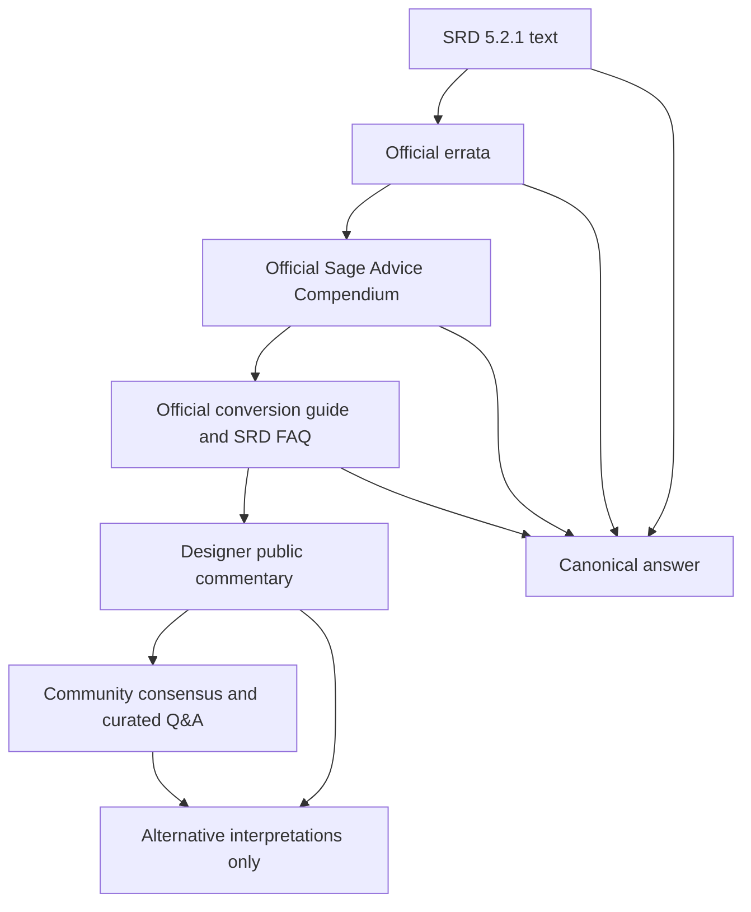
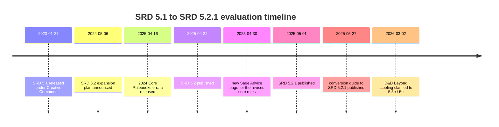

# Developing an SRD 5.2.1 Rules Corpus for AI Evaluation

## Executive summary

A strong evaluation corpus for an AI agent that answers rules questions about entity["brand","Dungeons & Dragons","tabletop role-playing game"] should be anchored to the official SRD 5.2.1 text first, then to official errata, then to the official urlSage Advice Compendiumturn4search1, then to the official conversion guide and SRD FAQ, and only after that to designer commentary and high-quality community consensus. That ordering is especially important because the current Sage Advice page explicitly says that official rulings are made there, while public statements by the D&D team are advice rather than official rulings. citeturn5view0turn10view0turn2view0

For a default benchmark size of 300 questions, the best distribution is not “300 random rules questions.” It should deliberately mix four buckets: common player/DM questions, difficult multi-rule interactions, contentious or debated edge cases, and version-specific tests that punish drift from SRD 5.2.1 into SRD 5.1 / 2014 rules or into non-SRD material. My recommended split is 120 common, 80 complex, 60 contentious, and 40 version-specific questions. The most valuable stress points are the 5.2.1 deltas and ambiguities that the official materials make unusually salient: D20 Tests as the umbrella term, Heroic Inspiration as a reroll rather than Advantage, Surprise imposing Disadvantage on Initiative instead of skipping a turn, Attack-action weapon equip/unequip, movement between attacks, saving-throw-only “roll once” damage, knockout at 1 HP, Hide after the 2025 errata, and scope-boundary questions about excluded material. citeturn6view0turn19view0turn2view0turn9view0

The official record also makes clear that SRD 5.2.1 is a distinct, pinned artifact: SRD 5.2.0 was published on April 22, 2025; the new Sage Advice and 2024 Core Rulebooks errata went live on April 30, 2025; SRD 5.2.1 followed on May 1, 2025 with 15 omitted magic items and other corrections; and the official conversion guide was published on May 27, 2025. On March 2, 2026, the publisher added a terminology note that the revised rules are labeled “5.5e” on D&D Beyond, but that this is a clarity update rather than a rules change. citeturn14view0turn9view0turn10view0turn1search1

The main conclusion is straightforward: a good corpus should not only test whether an agent knows rules, but whether it knows **which rule source outranks which**, whether it can recognize **official ambiguity**, and whether it can **refuse or scope-limit answers** when a question asks about material not actually present in SRD 5.2.1. That last point matters because the official FAQ says some content is deliberately excluded from SRD 5.2, including examples such as the Artificer, Aasimar, and Beholder, while Half-Elf and Half-Orc were removed from SRD 5.2-era materials and some protected names were replaced. citeturn5view0turn2view0

## Source hierarchy and evidence base

The recommended source hierarchy for corpus construction is: official SRD 5.2.1 text on urlD&D Beyond’s SRD pageturn1search1; official errata for the 2024/2025 core books; the official urlSage Advice Compendiumturn4search1; the official conversion guide to SRD 5.2.1; the SRD FAQ / release notes / community update; then non-official but useful sources such as community threads and curated Q&A. That hierarchy is justified by the official Sage Advice page itself, which states both that official rulings live there and that public statements from the D&D team are not official rulings. citeturn5view0turn14view0turn10view0

The official corpus of primary materials relevant to SRD 5.2.1 is unusually clean. The SRD page provides the downloadable SRD 5.2.1 PDF, the downloadable conversion guide, the prior SRD 5.2.0 and SRD 5.1 PDFs, and a FAQ explaining the content delta between 5.1 and 5.2.x. The FAQ identifies new sections, renamed content, newly added feats/spells/items/monsters, and explicitly removed or renamed content. The community update then documents the concrete 5.2.1 patch from 5.2.0, including the 15 omitted magic items plus the Knight and Octopus corrections. citeturn2view0turn9view0

For secondary materials, the best community corpora are those that reveal **where humans actually disagree**. In the available public record, the most persistent open or semi-open debates cluster around the Hide/Invisible interaction, Light/Nick weapon interactions, True Strike classification and downstream interactions, and high-level transformation spells such as Polymorph, Shapechange, and True Polymorph. D&D Beyond forum threads show these topics reappearing repeatedly, and curated RPG Stack Exchange pages preserve more formal argument structures that are useful for building alternative-answer rubrics. citeturn24view0turn24view1turn24view2turn24view3turn18view1turn18view2turn18view3

This precedence order reflects the official statements on what counts as an official ruling and the official record of how SRD versions are updated when errata lands. citeturn5view0turn10view0turn9view0

## Recommended corpus architecture

A 300-question benchmark should be explicitly stratified. The goal is not just breadth, but controlled **failure modes**: common questions test recall and table-utility, complex questions test compositional reasoning, contentious questions test ambiguity calibration, and version-specific questions test source discipline. The official materials strongly support this split because SRD 5.2.1 introduced many naming, action-economy, and glossary changes, while the official errata and Sage Advice also show that some high-value questions remain interaction-heavy rather than purely lexical. citeturn6view0turn19view0turn23view0turn23view3

### Recommended counts by primary bucket

| Bucket | Count | Purpose |
|---|---:|---|
| Common player / DM questions | 120 | Table-utility, FAQ coverage, common adjudications |
| Complex interactions | 80 | Multi-rule reasoning, action economy, layering |
| Contentious / debated rulings | 60 | Ambiguity handling, alternative-reading awareness |
| Version-specific / boundary tests | 40 | Prevent drift to 5.1 / 2014 / non-SRD content |
| **Total** | **300** | Default benchmark size |

### Recommended counts by difficulty

| Difficulty | Count | Typical shape |
|---|---:|---|
| Easy | 80 | Single rule, direct lookup |
| Medium | 110 | One rule + one exception or clarification |
| Hard | 80 | Multi-rule interaction or hidden version trap |
| Expert | 30 | Under-determined rules, scope-boundary, conflicting secondary readings |

### Recommended tags per question

Every item should carry at least these tags:

| Tag | Allowed values | Why it matters |
|---|---|---|
| Topic | e.g. combat, spellcasting, stealth, equipment, creation, monsters, exploration | Coverage accounting |
| Complexity | easy / medium / hard / expert | Benchmark slicing |
| Contentiousness | low / medium / high | Alternative-rubric routing |
| Version-specificity | none / medium / high | Drift detection |
| Answer status | resolved / ambiguous / out-of-scope | Canonical grading behavior |

A particularly useful addition is an **answer-status** flag. Some questions should have a standard canonical answer; others should have the canonical answer “officially unresolved or underdetermined by SRD 5.2.1”; and some should have the canonical answer “not answerable from SRD 5.2.1 alone because the content is out of scope.” That last category is justified by the official FAQ’s explicit exclusions and removals. citeturn2view0turn5view0

## Representative worked examples

The user asked for each corpus item to include concise question text, tags, a canonical answer, exact official grounding, alternative interpretations if any, and a grading rubric. A practical way to operationalize that is to build every item in the following shape:

| Field | Contents |
|---|---|
| Question | One-sentence prompt |
| Tags | Topic, complexity, contentiousness, version-specificity |
| Canonical answer | Two to six sentences |
| Official basis | SRD section + page; errata or Sage Advice if applicable |
| Alternatives | Secondary official or community readings |
| Rubric | Key points + partial credit rules |

The four examples below show what that should look like in practice. They are intentionally chosen from the highest-value areas: a common question, a complex interaction, a contentious errata-sensitive question, and a version-specific delta. citeturn5view0turn23view0turn23view3turn19view0turn6view0

### Common example

**Question**  
Can you delay your turn and act later in the round?

**Tags**  
Topic: combat/action economy  
Complexity: easy  
Contentiousness: low  
Version-specificity: medium

**Canonical answer**  
No. SRD 5.2.1 does not provide a “delay turn” option. If you want to wait for a trigger, the correct rules mechanism is the Ready action instead. citeturn5view0

**Official basis**  
Sage Advice answers this directly: “No,” and points players to the Ready action. The SRD Rules Glossary contains the current Ready action entry. citeturn5view0turn6view1

**Alternative interpretations**  
Many other games allow delaying turns, so model drift from other systems is common. That should not receive full credit here. There is no competing official 5.2.1 ruling. citeturn5view0

**Rubric**  
Full credit if the answer says delay is not available, names Ready as the intended alternative, and does not import another system’s initiative-delay mechanic. Half credit if it says “no” but does not identify Ready. Little or no credit if it says “yes” or equivocates without source hierarchy.

### Complex example

**Question**  
Can True Strike be used with Extra Attack?

**Tags**  
Topic: spellcasting/action economy  
Complexity: medium  
Contentiousness: medium  
Version-specificity: low

**Canonical answer**  
No. Casting True Strike requires the Magic action, not the Attack action, so it does not work with Extra Attack or any feature that specifically requires the Attack action. However, the attack made as part of True Strike can still interact with Sneak Attack if the normal Sneak Attack requirements are met. citeturn23view0

**Official basis**  
The current Sage Advice page states this explicitly and also clarifies the Sneak Attack point. The relevant structural rule is the 5.2.1 distinction between the Magic action and the Attack action. citeturn23view0turn6view0

**Alternative interpretations**  
Some community discussions blur “the spell lets you make a weapon attack” into “therefore this is the Attack action.” That is not the official reading. The main unresolved downstream debate is not Extra Attack, but whether True Strike’s attack should count as a spell attack, a weapon attack, or both for other edge-case interactions. citeturn23view0turn24view1turn24view2

**Rubric**  
Full credit requires: no Extra Attack interaction; explicit Magic-action reasoning; optional bonus credit inside the benchmark notes if the answer also correctly says Sneak Attack can still apply. Partial credit if it says “no” but gives only a vague reason. Low credit if it says “yes because it includes a weapon attack.”

### Contentious example

**Question**  
After the 2025 errata, what exactly does Hide grant, and what ends it?

**Tags**  
Topic: stealth / conditions  
Complexity: hard  
Contentiousness: high  
Version-specificity: high

**Canonical answer**  
On a successful Hide check, you have the Invisible condition **while hidden**. You stop being hidden if you make more than a whisper of noise, an enemy finds you, you make an attack roll, or you cast a spell with a Verbal component. If a creature with Blindsight or Truesight finds you, you are no longer hidden. citeturn19view0turn23view3

**Official basis**  
The April 2025 errata changed the wording from “you have the Invisible condition” to “you have the Invisible condition while hidden,” and changed the ending language from “The condition ends on you” to “You stop being hidden.” Sage Advice then confirms that a creature with Blindsight or Truesight that finds you ends the hidden state. citeturn19view0turn23view3

**Alternative interpretations**  
Early post-release debate focused on whether the old wording accidentally made Hide confer a broadly freestanding Invisible condition rather than a hidden-state package. Community discussions and RPG Stack Exchange threads document that confusion, and they are useful for alternative-answer tests, but after the errata they should no longer control the gold answer. citeturn24view3turn18view3turn18view2

**Rubric**  
Full credit requires three points: the hidden-state wording after errata, the four explicit break conditions, and the “found by Truesight/Blindsight ends hidden” clarification. Partial credit if the answer gets the practical result right but uses the pre-errata wording. Low credit if it treats Hide as granting unconditional invisibility.

### Version-specific example

**Question**  
How does Surprise work in SRD 5.2.1?

**Tags**  
Topic: combat/order of combat  
Complexity: easy  
Contentiousness: low  
Version-specificity: high

**Canonical answer**  
Being surprised no longer prevents you from acting on your first turn. In SRD 5.2.1, Surprise instead imposes Disadvantage on your Initiative roll. citeturn6view0

**Official basis**  
The conversion guide states this as a specific revised rule for Surprise. The SRD FAQ also says SRD 5.2 updates wording and mechanics to the revised core rules. citeturn6view0turn2view0

**Alternative interpretations**  
A large amount of edition drift will produce the older “lose your first turn” answer. That should be scored as wrong for an SRD 5.2.1 benchmark even if it matches 5.1 / 2014 expectations. citeturn6view0

**Rubric**  
Full credit if the answer says “Disadvantage on Initiative” and explicitly rejects “skip the first turn.” Partial credit if the answer says it changed from the old rule but does not state the new mechanic precisely.

## Sample sets

The four sample sets below are the right shape for the first 80 items of a 300-question benchmark. They are drawn from recurring official Sage Advice topics, the official conversion guide, the official errata, and the most persistent public debates around the revised rules. citeturn5view0turn6view0turn19view0turn24view0

### Common sample set

| ID | Question |
|---|---|
| C001 | What kinds of rolls are D20 Tests in SRD 5.2.1? |
| C002 | Are attack rolls and saving throws specialized ability checks? |
| C003 | Is a natural 1 on an ability check an automatic failure? |
| C004 | Can ability checks score critical hits? |
| C005 | Can you delay your turn and act later in the round? |
| C006 | Can you use a Bonus Action as an Action or vice versa? |
| C007 | If a feature grants Dash as a Bonus Action, can you Dash more than once on your turn? |
| C008 | If you have a readied action, can you still make an Opportunity Attack? |
| C009 | Is there a hard limit on Short Rests per day? |
| C010 | Does all magical Darkness block Darkvision? |
| C011 | If you are hidden and a creature with Blindsight or Truesight perceives you, are you still hidden? |
| C012 | If you attack with a magic longbow and nonmagical arrows, is the attack magical? |
| C013 | Do you gain a shield’s AC bonus merely by holding it? |
| C014 | Can a character have more than one background? |
| C015 | Do species grant ability score increases in SRD 5.2.1? |
| C016 | How many languages does a starting character choose? |
| C017 | Can different AC-calculation features stack? |
| C018 | What happens when you knock a creature out instead of killing it? |
| C019 | Can Greater Restoration reduce Exhaustion? |
| C020 | Are extradimensional spaces treated as a different plane of existence? |

### Complex sample set

| ID | Question |
|---|---|
| X001 | Can True Strike be used with Extra Attack? |
| X002 | Can True Strike be used to make an Opportunity Attack? |
| X003 | Can the attack made as part of True Strike deal Sneak Attack damage? |
| X004 | When you use the Light property, must the extra attack be made with a different Light weapon? |
| X005 | Does Great Weapon Fighting apply to extra damage dice such as Divine Smite or Hex? |
| X006 | If a controlled mount moves 10 feet straight toward a target, can you use Charger’s attack benefit? |
| X007 | Can you maintain concentration on a spell while transformed by Polymorph? |
| X008 | If a Polymorphed creature reverts after elemental damage, does the true form’s resistance apply to leftover damage? |
| X009 | Does Polymorph erase other spell effects already affecting the target? |
| X010 | Does using Grapple or Shove end your Sanctuary spell? |
| X011 | If a Wizard casts a prepared spell as a ritual, must the spellbook be consulted during casting? |
| X012 | If Shillelagh affects a Quarterstaff and you also have Polearm Master, what die does the bonus attack use? |
| X013 | Can Unseen Servant count as an ally for Sneak Attack? |
| X014 | Can you Dash with both Action and Bonus Action on the same turn if you have a feature that grants Bonus-Action Dash? |
| X015 | In SRD 5.2.1, do simultaneous multi-target damage effects always roll damage once for all targets? |
| X016 | Can you move between attacks granted by the Attack action? |
| X017 | Does the Attack action let you equip or unequip a weapon with each attack you make as part of that action? |
| X018 | Does moving through an ally’s space count as Difficult Terrain in SRD 5.2.1? |
| X019 | Under SRD 5.2.1 underwater combat, which weapons avoid disadvantage if you lack a Swim Speed? |
| X020 | Can a creature with Speed 0 choose to drop prone? |

### Contentious sample set

| ID | Question |
|---|---|
| T001 | After the 2025 errata, what exactly does Hide grant, and what ends it? |
| T002 | Does See Invisibility or Truesight defeat the hidden state produced by Hide? |
| T003 | Does the Invisible condition itself make a creature literally unseen in every context, or only protect against effects that require seeing the target? |
| T004 | Does True Strike activate Agonizing Blast? |
| T005 | Is the attack made by True Strike a Weapon Attack, a Spell Attack, or both? |
| T006 | In 5.2.1-era rules, can Shapechange or True Polymorph grant Legendary Actions? |
| T007 | Does Nick create an extra attack, or does it merely move the Light-property attack into the Attack action? |
| T008 | Can Nick be used more than once per turn with multiple qualifying weapons? |
| T009 | Do you need to be wielding two qualifying weapons simultaneously to benefit from the Light property’s extra attack? |
| T010 | If you cast a non-Verbal spell while hidden but the fiction obviously reveals your position, does RAW end hiding anyway? |
| T011 | Does Counterspell stop a non-spell magical feature that uses the Magic action? |
| T012 | How should Counterspell interact with revised monster actions that resemble spells but are not traditional slot-casting? |
| T013 | Does a shield only require training and donning, or must it also be held in a hand? |
| T014 | If True Polymorph changes you into a form with its own spellcasting in the stat block, can you speak or cast spells? |
| T015 | Do lair actions transfer through Shapechange or True Polymorph? |
| T016 | If one enemy finds a hidden creature, is that creature no longer hidden against everyone? |
| T017 | Does the DC 15 in Hide replace discovery checks, or is it only the entry threshold before later Perception checks matter? |
| T018 | Does magical Darkness from non-spell sources block Darkvision when the specific text does not say so? |
| T019 | Should a benchmark treat designer tweets as authoritative gold answers? |
| T020 | When the official text is underdetermined, should the gold answer be “officially unresolved”? |

### Version-specific sample set

| ID | Question |
|---|---|
| V001 | What is a D20 Test, and is that term used in SRD 5.1? |
| V002 | Is Heroic Inspiration Advantage, or is it a reroll? |
| V003 | Does Surprise skip your first turn, or impose Disadvantage on Initiative? |
| V004 | Is the action name still Use an Object, or is it Utilize? |
| V005 | Is the action name still Cast a Spell, or is it Magic? |
| V006 | Has Search been split into Search and Study? |
| V007 | Is Influence a distinct action in SRD 5.2.1? |
| V008 | Do species still grant languages? |
| V009 | Do species still grant ability score increases? |
| V010 | Do backgrounds now grant ability score increases and an Origin feat? |
| V011 | Are Half-Elf and Half-Orc present in SRD 5.2.1? |
| V012 | Is Goliath present in SRD 5.2.1? |
| V013 | Is Orc present in SRD 5.2.1? |
| V014 | Are Weapon Masteries part of SRD 5.2.1? |
| V015 | Does the Attack action include weapon equip/unequip per attack? |
| V016 | Is a shield donned and doffed with the Utilize action? |
| V017 | Do knockout rules leave the target at 0 HP or 1 HP? |
| V018 | For simultaneous damage, does “roll once” still apply generally, or only to saving-throw effects? |
| V019 | Is Common Sign Language present in SRD 5.2.1? |
| V020 | Are Deck of Many Things and Orb of Dragonkind renamed in SRD 5.2.1? |

## Automated grading method and example test runs

The grading system should be rubric-based rather than exact-string-based. For most questions, use a 10-point scale: **4 points** for substantive accuracy, **2 points** for source fidelity, **2 points** for version fidelity, **1 point** for ambiguity handling, and **1 point** for citation quality. For officially ambiguous questions, move one point from substantive accuracy to ambiguity handling, so that a model receives full credit for correctly saying that the primary sources do not settle the issue. This weighting follows directly from the official source hierarchy and the living nature of the Sage Advice page. citeturn5view0turn14view0

The most effective automated heuristics are these. First, verify **key-point coverage** against the item rubric rather than against surface wording. Second, detect **version drift** by penalizing 5.1 / 2014-only claims when the question is pinned to SRD 5.2.1. Third, detect **source-rank errors** by downgrading answers that rely on tweets or forum posts when primary materials settle the issue. Fourth, reward **scope discipline** when the correct answer is “not in SRD 5.2.1.” Fifth, for contentious items, reward **ambiguity acknowledgement** and correct separation of canonical answer from alternative readings. citeturn5view0turn2view0turn24view0

A useful practical rule is to build each gold item with a machine-readable checklist: `must_say`, `must_not_say`, `optional_bonus`, `required_source_class`, and `version_traps`. For example, the Surprise item would have `must_say = ["disadvantage on initiative"]`, `must_not_say = ["lose your first turn"]`, and `version_traps = ["2014 surprise rule"]`. The Hide errata item would have `must_say = ["while hidden"]` and `must_not_say = ["grants unconditional invisible condition"]`. That converts naturally into deterministic or hybrid-LLM grading.

### Example test runs

| Question | Sample agent answer | Score | Why |
|---|---|---:|---|
| Can you delay your turn? | “Yes, you can choose to go later in initiative if you haven’t acted yet.” | 1/10 | Imports non-SRD behavior; contradicts official Sage Advice |
| Can True Strike be used with Extra Attack? | “No. True Strike uses the Magic action, not the Attack action, so Extra Attack does not apply.” | 9/10 | Correct outcome and reasoning; would reach 10/10 with explicit official citation |
| After the 2025 errata, what does Hide grant? | “On a success, you have the Invisible condition while hidden. You stop being hidden if found, if you make more than a whisper of noise, if you attack, or if you cast a verbal spell.” | 10/10 | Correctly incorporates the errata-sensitive wording and trigger list |
| How does Surprise work in SRD 5.2.1? | “Surprised creatures lose their first turn.” | 2/10 | Classic 5.1 / 2014 drift; identifies the right topic but gives the wrong mechanic |
| Does True Strike activate Agonizing Blast? | “Probably yes, because the spell causes damage with an attack.” | 4/10 | Acknowledges an interaction, but overstates certainty on an area not cleanly resolved by the official 5.2.1 primary materials |

## Reproducible workflow

The corpus-building process should be reproducible and version-pinned. The cleanest workflow is: snapshot the official SRD 5.2.1 PDF, snapshot the current official Sage Advice page, snapshot the official errata PDFs, snapshot the official conversion guide, and record the official SRD FAQ / community update page versions used. Then derive candidate questions from four streams: official FAQ/Sage Advice questions; conversion-guide deltas; errata-sensitive wording changes; and recurring community-debate topics. Finally, deduplicate by semantic overlap and assign each question a primary bucket, topic tag, difficulty, and answer-status flag. citeturn1search1turn14view0turn19view0turn9view0turn2view0

The search terms that produce the highest-yield candidate pool are narrow and mechanical rather than generic. The official-source pass should use terms such as: “SRD 5.2.1,” “Converting to SRD 5.2.1,” “2024 Core Rulebooks Errata,” “Sage Advice Compendium,” and “SRD 5.2 FAQ.” The contention-mining pass should use interaction phrases such as “Hide invisible 2024,” “True Strike Extra Attack,” “True Strike Agonizing Blast,” “Nick Light weapon,” “shield utilize action,” “counterspell magic action,” and “True Polymorph legendary actions.” These were the clusters that repeatedly surfaced in the public materials reviewed above. citeturn24view0turn24view1turn24view2turn24view3turn18view1turn18view2turn18view3

A benchmark built this way should also explicitly record a **snapshot date** and **authority map**. That matters because the official Sage Advice page is a living resource and because the current D&D Beyond labeling now distinguishes “5e” and “5.5e” as a site-label clarity update while keeping both rulesets supported. Without a snapshot discipline, the benchmark will silently drift. citeturn14view0turn10view0

This timeline is assembled from the official SRD page, official changelog / Sage Advice release, official community update, and the March 2026 clarification note on the release article. citeturn2view0turn14view0turn9view0turn10view0

## Open questions and limitations

The largest unresolved issue is not lack of official material, but the existence of a handful of **important underdetermined interactions**. The public record reviewed here strongly suggests that the following should be treated as “ambiguous or not fully settled by SRD 5.2.1 primary sources” unless newer official rulings are pinned into the benchmark snapshot: deeper classification issues around True Strike beyond the points already settled by Sage Advice; Light/Nick interactions when combined with non-SRD feats or unusual weapon-handling sequences; and whether revised transformation spells grant Legendary Actions or lair actions. Those are exactly the sorts of items where the benchmark should reward ambiguity recognition rather than overconfident invention. citeturn23view0turn24view1turn24view2turn24view0turn25search0

A second limitation is scope. Some highly discussed rules questions in the revised 2024/2025 game concern material not actually present in SRD 5.2.1. The official FAQ explicitly notes exclusions such as the Artificer, Aasimar, and Beholder, and it also notes renames or removals such as Half-Elf, Half-Orc, Mysterious Deck, and Dragon Orb. A benchmark that claims to test “SRD 5.2.1 fidelity” should therefore include scope-detection items and should mark non-SRD material as out-of-scope unless the item is intentionally testing boundary awareness. citeturn2view0

A final practical limitation is response length. A truly complete 300-item appendix with fully written canonical answers, alternative readings, and detailed partial-credit rules for every item is best maintained as a structured artifact rather than inline prose. The report above therefore provides the source hierarchy, the 300-item architecture, four fully worked examples, an 80-item sample suite, and the reproducible method needed to instantiate the full benchmark without changing its evidentiary standards.