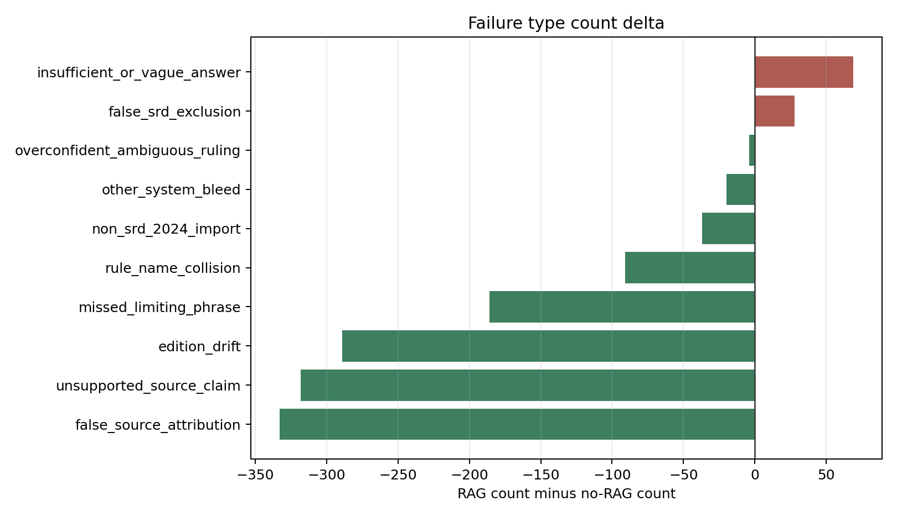

# Retrieval Improves SRD Rules QA, But Not Uniformly

**A benchmark study of retrieval-augmented generation for D&D SRD 5.2.1 rules questions.**

[Open the paired answer browser](./rag-comparison/) · [Open the question-set browser](./question-set/) · [Read the performance report](../reports/rag-vs-no-rag-performance.md)

## Abstract

This project evaluates whether retrieval-augmented generation (RAG) improves model answers to rules questions grounded in the *Dungeons & Dragons System Reference Document 5.2.1*. Five models answered 180 benchmark questions twice: once without retrieval and once with retrieved SRD context. A custom OpenRouter-backed LLM judge then scored 900 matched `(question_id, model)` pairs against the same benchmark rows and rubric fields.

Overall, RAG improved judged answer quality. Average score increased from **0.457** to **0.633**, and passing answers increased from **282** to **487**. At the same time, RAG did not uniformly improve every model or every question category; the paired browser is intended to make both gains and regressions inspectable.

## Key Findings

| Measure | No RAG | RAG | Change |
| --- | ---: | ---: | ---: |
| Matched answer pairs | 900 | 900 | - |
| Average judged score | 0.457 | 0.633 | +0.176 |
| Passing answers | 282 | 487 | +205 |
| Improved pairs | - | 572 | - |
| Declined pairs | - | 234 | - |
| Unchanged pairs | - | 94 | - |

The largest model-level lift was observed for `ibm-granite/granite-4.1-8b`, while the smallest lift was observed for `qwen/qwen3.7-max`. RAG most reduced failures involving false source attribution, unsupported source claims, and edition drift.

## Interactive Artifact

The primary public results artifact is the paired answer browser:

**[Open the RAG vs no-RAG answer browser](./rag-comparison/)**

The browser lets readers filter by model, question source, category, difficulty, score swing, and judged error type. For each selected pair, it shows the no-RAG answer, the RAG answer, judge rationales, diagnostic flags, and retrieved context.

The companion benchmark artifact is the question-set browser:

**[Open the question-set browser](./question-set/)**

The question-set browser answers a different question: not "did retrieval help?", but "what exactly was asked, how was the expected answer grounded, and where was ambiguity preserved?" It is important context for interpreting the scores, because the judge compares model answers against these benchmark rows rather than against an informal impression of the rules.

## Results


*Figure 1. Average judged score delta by model after adding retrieved SRD context.*


*Figure 2. Score delta by model and difficulty. Easy and medium questions show the strongest gains; hard questions are more mixed.*

RAG improved performance most clearly on easy and medium questions, with smaller and less uniform gains on hard questions. This pattern is consistent with retrieval resolving source-grounding and edition-confusion failures while not automatically solving questions that require multi-step reasoning, careful limiting phrases, or synthesis across rules.

## Error Analysis



*Figure 3. Change in judged failure-type counts. Negative values indicate fewer failures with RAG.*

The strongest reductions were in:

- `false_source_attribution`
- `unsupported_source_claim`
- `edition_drift`
- `missed_limiting_phrase`

The most notable increase was `insufficient_or_vague_answer`, suggesting that retrieval sometimes made answers more cautious or less complete. This is one reason the site foregrounds paired inspection rather than only aggregate metrics.

## Benchmark And Provenance

The benchmark contains 180 SRD-focused questions. Rows preserve question text, expected answers, answer-status annotations, source/provenance fields, and failure-mode tags. These fields are part of the judging context: they define what counts as a correct, incomplete, unsupported, or overconfident answer for each question.

The question-set browser is therefore not just a dataset convenience. It is the audit layer for the evaluation. It lets readers inspect:

- the exact question text and stable `question_id`
- the expected answer and refined grading criteria
- whether the row is resolved or intentionally ambiguous
- common wrong answers and failure-mode tags
- source and provenance fields used to ground the row

The benchmark intentionally preserves some ambiguity. In those cases, the goal is not to force a single table ruling, but to test whether a model can state the limits of what SRD 5.2.1 supports.

The benchmark combines curated SRD-focused questions developed in this repository with prior public work on SRD question answering. In particular, it builds around the SRD 5.2.1 text and the [Datapizza AI Lab D&D 5.2.1 SRD RAG Evaluation Dataset](https://huggingface.co/datasets/datapizza-ai-lab/dnd5e-srd-qa), extending the evaluation toward version-specific rules questions, ambiguous rulings, source-scope failures, and retrieval-sensitive failure modes.

## Methods

The comparison uses matched `(question_id, model)` pairs only. Each model answered each benchmark question in two conditions:

1. **No RAG:** the model answered from its own context and prompt instructions.
2. **RAG:** the model answered with retrieved SRD context from the Chroma-backed retrieval pipeline.

Both answer sets were judged with the same OpenRouter-backed grading workflow and structured diagnostic taxonomy. Some internal filenames still contain `deepeval` from an earlier implementation direction, but the structured judging code used for these results calls the judge through the project's OpenRouter client. The static browser uses a prebuilt JSON dataset derived from the preserved run artifacts, so it can run entirely in a reader's browser.

## Related Projects And Infrastructure

This project depends on several public datasets, tools, and libraries:

- [D&D System Reference Document 5.2.1](https://www.dndbeyond.com/srd), the CC-BY-4.0 rules text used as the source of truth.
- [Datapizza AI Lab's D&D 5.2.1 SRD RAG Evaluation Dataset](https://huggingface.co/datasets/datapizza-ai-lab/dnd5e-srd-qa), which provided an important public SRD QA benchmark reference.
- [downfallx/dnd-5e-srd-markdown](https://github.com/downfallx/dnd-5e-srd-markdown), used as a machine-readable SRD 5.2.1 markdown source.
- [marimo](https://marimo.io), used for the question-set browser, analysis notebooks, and the exported WebAssembly answer browser.
- [OpenRouter](https://openrouter.ai), used directly through this project's client code for answer generation, embeddings, and the structured LLM judge.
- [Chroma](https://www.trychroma.com), used for local vector retrieval over SRD chunks.
- [LangChain text splitters](https://python.langchain.com/docs/concepts/text_splitters/), used to split the markdown SRD into header-aware, token-bounded chunks before embedding.
- [Pyodide](https://pyodide.org), which underlies the browser-executed Python environment used by marimo's WebAssembly export.

## Limitations

This site reports judged answer quality, not ground-truth human adjudication of every answer. The LLM judge is useful for scalable comparison, but individual examples should be inspected before drawing strong conclusions about a model or retrieval setting.

The retrieval distance shown in the browser is a retrieval diagnostic, not a correctness score. Low distance can indicate a close vector match, but correctness still depends on whether the retrieved passage is relevant, complete, and used well by the model.

## Reproducibility

The published browser is built from preserved artifacts in the repository. To preview the site locally from the repository root, run:

```powershell
$env:UV_CACHE_DIR='.uv-cache'; uv run python -m http.server --directory docs 8000
```

Then open `http://127.0.0.1:8000/`.

To rebuild the Markdown landing page after editing `docs/index.md`, run:

```powershell
$env:UV_CACHE_DIR='.uv-cache'; uv run python scripts\build_site.py
```

To rebuild the question-set browser export, use the workflow documented in `apps/question-set/README.md`. To rebuild the RAG comparison data and marimo export, use the workflow documented in `apps/rag-comparison/README.md`.
