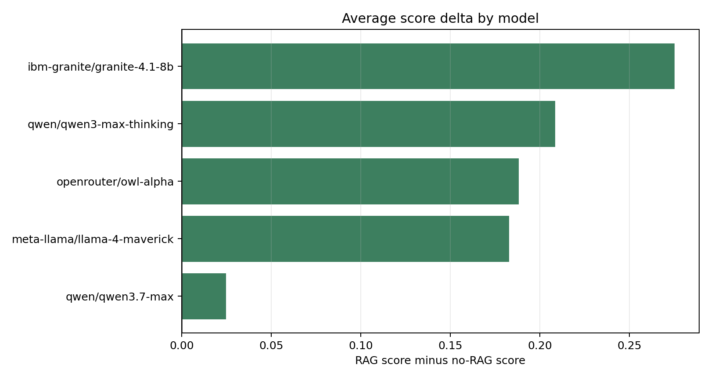
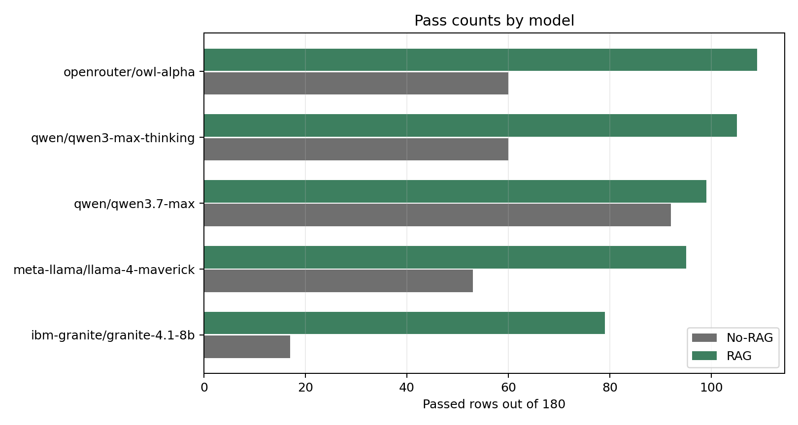
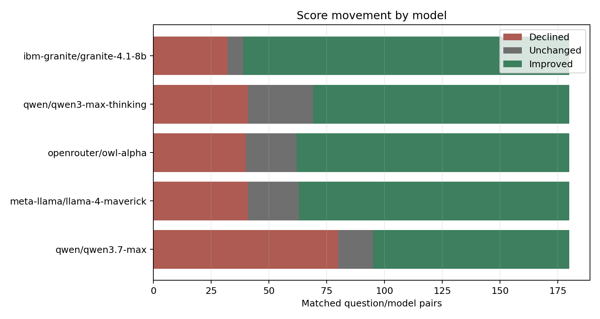
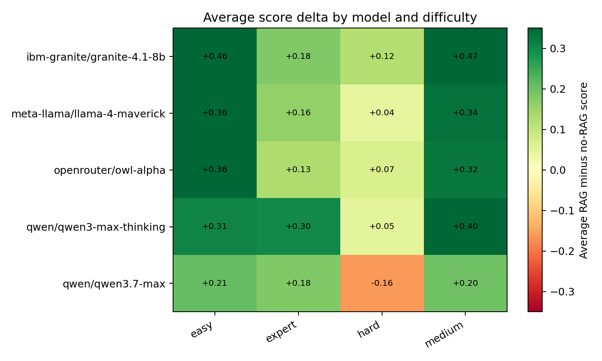
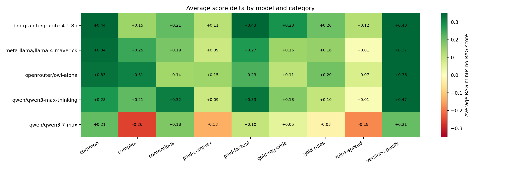
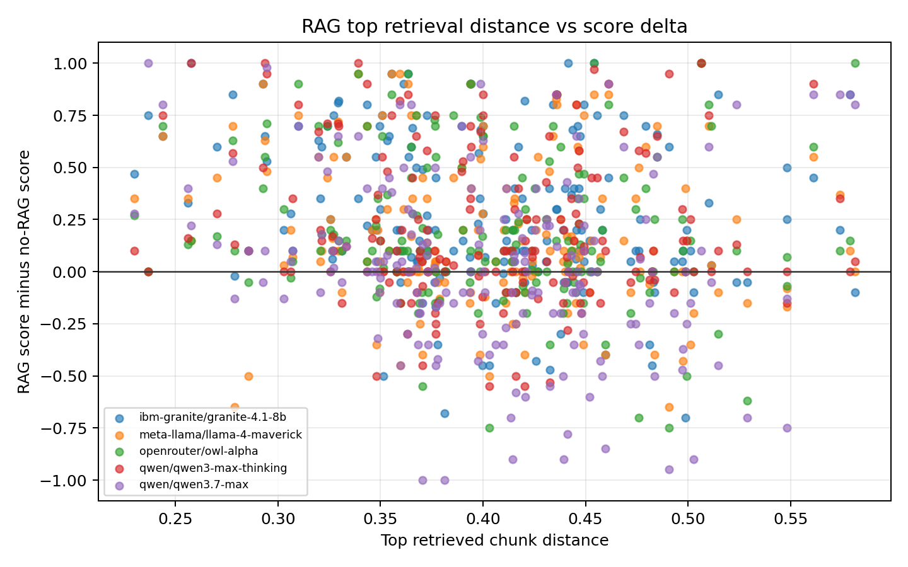

# RAG vs No-RAG Performance Report

Generated by `scripts/build_rag_comparison_report.py`.

## Executive Summary

This report compares the preserved no-RAG run against the full Chroma RAG run using matched `(question_id, model)` pairs only. The comparison includes 900 matched pairs across 5 models, with 0 no-RAG score errors and 0 RAG score errors skipped.

Overall, RAG raised the average judged score from 0.457 to 0.633, an average delta of +0.176. Passes increased from 282 to 487, a change of +205 paired rows. At the row level, RAG improved 572 pairs, declined on 234, and left 94 unchanged.

The biggest model-level lift was `ibm-granite/granite-4.1-8b` at +0.275 average score delta. The smallest lift was `qwen/qwen3.7-max` at +0.025. RAG most reduced `false_source_attribution` (-333 rows), while `insufficient_or_vague_answer` increased the most (+69 rows).

Coverage checks: no-RAG score rows = 900, RAG score rows = 900, unmatched no-RAG pairs = 0, unmatched RAG pairs = 0.

## Model-Level Performance

| Model | Pairs | No-RAG Avg | RAG Avg | Avg Delta | No-RAG Pass | RAG Pass | Pass Delta | Improved | Unchanged | Declined |
| --- | --- | --- | --- | --- | --- | --- | --- | --- | --- | --- |
| ibm-granite/granite-4.1-8b | 180 | 0.267 | 0.542 | +0.275 | 17 | 79 | +62 | 141 | 7 | 32 |
| qwen/qwen3-max-thinking | 180 | 0.459 | 0.668 | +0.208 | 60 | 105 | +45 | 111 | 28 | 41 |
| openrouter/owl-alpha | 180 | 0.487 | 0.675 | +0.188 | 60 | 109 | +49 | 118 | 22 | 40 |
| meta-llama/llama-4-maverick | 180 | 0.445 | 0.628 | +0.183 | 53 | 95 | +42 | 117 | 22 | 41 |
| qwen/qwen3.7-max | 180 | 0.628 | 0.652 | +0.025 | 92 | 99 | +7 | 85 | 15 | 80 |

## Failure-Type Shifts

Negative deltas are good in this table: they mean RAG produced fewer judged failures of that type than no-RAG.

| Failure Type | No-RAG Count | RAG Count | Delta | Resolved by RAG | New in RAG |
| --- | --- | --- | --- | --- | --- |
| false_source_attribution | 488 | 155 | -333 | 382 | 49 |
| unsupported_source_claim | 589 | 271 | -318 | 381 | 63 |
| edition_drift | 383 | 94 | -289 | 310 | 21 |
| missed_limiting_phrase | 601 | 415 | -186 | 255 | 69 |
| rule_name_collision | 175 | 84 | -91 | 137 | 46 |
| non_srd_2024_import | 89 | 52 | -37 | 77 | 40 |
| other_system_bleed | 22 | 2 | -20 | 22 | 2 |
| overconfident_ambiguous_ruling | 36 | 32 | -4 | 8 | 4 |
| false_srd_exclusion | 104 | 132 | +28 | 69 | 97 |
| insufficient_or_vague_answer | 143 | 212 | +69 | 63 | 132 |

## Benchmark Slices

The difficulty and category views show where RAG changed performance most. Positive values mean RAG improved the average score for that slice.

### Difficulty

| Difficulty | Pairs | No-RAG Avg | RAG Avg | Avg Delta | Pass Delta |
| --- | --- | --- | --- | --- | --- |
| medium | 280 | 0.387 | 0.732 | +0.345 | +130 |
| easy | 110 | 0.540 | 0.881 | +0.341 | +53 |
| expert | 75 | 0.337 | 0.526 | +0.189 | +11 |
| hard | 435 | 0.503 | 0.526 | +0.023 | +11 |

### Category

| Category | Pairs | No-RAG Avg | RAG Avg | Avg Delta | Pass Delta |
| --- | --- | --- | --- | --- | --- |
| version-specific | 155 | 0.361 | 0.741 | +0.380 | +71 |
| common | 105 | 0.557 | 0.877 | +0.320 | +49 |
| gold-factual | 45 | 0.459 | 0.731 | +0.272 | +19 |
| contentious | 80 | 0.336 | 0.545 | +0.209 | +16 |
| gold-rag-wide | 165 | 0.352 | 0.505 | +0.153 | +39 |
| complex | 30 | 0.283 | 0.416 | +0.133 | +4 |
| gold-rules | 25 | 0.282 | 0.408 | +0.126 | +5 |
| gold-complex | 45 | 0.407 | 0.468 | +0.060 | -2 |
| rules-spread | 250 | 0.631 | 0.638 | +0.007 | +4 |

### Answer Status

| Answer Status | Pairs | No-RAG Avg | RAG Avg | Avg Delta | Pass Delta |
| --- | --- | --- | --- | --- | --- |
| resolved | 865 | 0.460 | 0.638 | +0.178 | +202 |
| ambiguous | 35 | 0.405 | 0.519 | +0.114 | +3 |

## Retrieval Quality

The RAG run records the top retrieved context and Chroma distance for each answer. Lower distance generally means a closer vector match, but this is not a direct correctness score. The scatter plot is useful for spotting whether regressions cluster around weaker retrieval.

### Top Retrieved Source Files

| Top Source File | Pairs | Avg Delta | Avg Top Distance | Improved | Declined |
| --- | --- | --- | --- | --- | --- |
| rules-glossary.md | 265 | +0.253 | 0.393 | 188 | 50 |
| classes.md | 185 | +0.052 | 0.400 | 87 | 71 |
| spells.md | 145 | +0.242 | 0.389 | 107 | 27 |
| monsters-A-Z.md | 90 | +0.064 | 0.435 | 46 | 37 |
| playing-the-game.md | 60 | +0.197 | 0.411 | 41 | 9 |
| gameplay-toolbox.md | 30 | +0.442 | 0.370 | 24 | 5 |
| equipment.md | 30 | +0.142 | 0.440 | 14 | 12 |
| magic-items.md | 30 | +0.126 | 0.425 | 22 | 7 |
| character-origins.md | 25 | +0.158 | 0.483 | 18 | 6 |
| character-creation.md | 15 | +0.148 | 0.369 | 9 | 4 |
| feats.md | 15 | +0.079 | 0.384 | 10 | 3 |
| monsters.md | 10 | +0.042 | 0.496 | 6 | 3 |

### Distance Bins

| Top Distance Bin | Pairs | Avg Delta | Improved | Declined |
| --- | --- | --- | --- | --- |
| <=0.45 | 705 | +0.185 | 464 | 173 |
| 0.45-0.50 | 125 | +0.103 | 66 | 40 |
| 0.50-0.55 | 50 | +0.121 | 25 | 20 |
| 0.55-0.60 | 20 | +0.446 | 17 | 1 |

## Largest Wins and Regressions

### Largest RAG Wins

| Question ID | Model | No-RAG | RAG | Delta | Failure Change | Question |
| --- | --- | --- | --- | --- | --- | --- |
| chatgpt-version_specific-example | ibm-granite/granite-4.1-8b | 0.00 | 1.00 | +1.00 | Improved; RAG resolved edition_drift, false_source_attribution, unsupported_source_claim. | How does Surprise work in SRD 5.2.1? |
| chatgpt-version_specific-example | openrouter/owl-alpha | 0.00 | 1.00 | +1.00 | Improved; RAG resolved edition_drift, false_source_attribution, unsupported_source_claim. | How does Surprise work in SRD 5.2.1? |
| claude-q035 | ibm-granite/granite-4.1-8b | 0.00 | 1.00 | +1.00 | Improved; RAG resolved false_source_attribution, unsupported_source_claim. | Do temp HP from Dark One's Blessing stack with other temp HP? |
| claude-q057 | openrouter/owl-alpha | 0.00 | 1.00 | +1.00 | Improved; RAG resolved edition_drift, false_srd_exclusion, unsupported_source_claim. | Is Wish in SRD 5.2.1? |
| claude-q069 | ibm-granite/granite-4.1-8b | 0.00 | 1.00 | +1.00 | Improved; RAG resolved false_source_attribution, false_srd_exclusion, missed_limiting_phrase. | Does crawling cost extra movement? |
| claude-q069 | qwen/qwen3-max-thinking | 0.00 | 1.00 | +1.00 | Improved; RAG resolved false_source_attribution, missed_limiting_phrase, unsupported_source_claim. | Does crawling cost extra movement? |
| claude-q070 | qwen/qwen3-max-thinking | 0.00 | 1.00 | +1.00 | Improved; RAG resolved edition_drift, false_source_attribution, unsupported_source_claim. | Does Conjure Animals summon multiple beasts in SRD 5.2.1? |
| claude-q075 | ibm-granite/granite-4.1-8b | 0.00 | 1.00 | +1.00 | Improved; RAG resolved edition_drift, false_source_attribution, missed_limiting_phrase. | What's the new name for "Use an Object"? |

### Largest RAG Regressions

| Question ID | Model | No-RAG | RAG | Delta | Failure Change | Question |
| --- | --- | --- | --- | --- | --- | --- |
| claude-q046 | qwen/qwen3.7-max | 1.00 | 0.00 | -1.00 | Regressed; RAG introduced insufficient_or_vague_answer. | A Wizard Readies Fireball. Slot expended at cast or at trigger? |
| gold-medium-010 | qwen/qwen3.7-max | 1.00 | 0.00 | -1.00 | Regressed; RAG introduced insufficient_or_vague_answer. | Highest instant damage spell that can be cast by a level 5 Wizard? |
| claude-q100 | qwen/qwen3.7-max | 0.95 | 0.00 | -0.95 | Regressed; RAG introduced insufficient_or_vague_answer, missed_limiting_phrase. | Standing up costs half Speed (movement). Does it provoke OAs? |
| claude-q012 | qwen/qwen3.7-max | 1.00 | 0.10 | -0.90 | Regressed; RAG introduced insufficient_or_vague_answer. | A Berserker Frenzying with a Cleave-mastery weapon: does Cleave trigger from the Frenzy attack? Can Cleave... |
| claude-q047 | qwen/qwen3.7-max | 0.90 | 0.00 | -0.90 | Regressed; RAG introduced insufficient_or_vague_answer. | Glaive (Cleave). Miss first, hit second on a different target. Cleave triggers? |
| gemini-hc-05 | qwen/qwen3.7-max | 1.00 | 0.10 | -0.90 | Regressed; RAG introduced insufficient_or_vague_answer. | I am holding a Shortsword in one hand and a Dagger with the Nick mastery property in the other. If I attack... |
| claude-q007 | qwen/qwen3.7-max | 0.85 | 0.00 | -0.85 | Regressed; score changed without a failure-type change. | Does Topple work on an Opportunity Attack with a Glaive against a creature with Magic Resistance? |
| claude-q009 | qwen/qwen3.7-max | 0.78 | 0.00 | -0.78 | Regressed; resolved false_source_attribution, missed_limiting_phrase, introduced insufficient_or_vague_answer. | A Medium Paladin grapples a Large dragon while it's flying. What happens? |

## Notes

- Primary metric: DeepEval judged score and threshold pass/fail.
- Pairing key: `(question_id, model)`.
- No-RAG artifact: `runs/no_rag/no-rag-20260603T074521Z-07aa8696/answers_for_grading.deepeval_scores.success_only.jsonl`.
- RAG artifact: `runs/rag/rag-chroma-20260604-full/answers.deepeval_scores.jsonl`.
- RAG retrieval artifact: `runs/rag/rag-chroma-20260604-full/answers.jsonl`.
